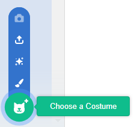

- با انتخاب شبح خود، بر روی زبانه لباس کلیک کنید
    
    

- Click **Choose a Costume** and choose one of the five options From bottom to top they are:
    
    1. لباس از کتابخانه انتخاب کنید
    2. لباس جدید نقاشی کنید
    3. از یک لباس (شبح) تصادفی استفاده کنید
    4. آپلود لباس از فایل
    5. لباس جدید از دوربین
    
    

- اگر می خواهید لباس وارد شده را حذف کنید، آن را انتخاب کنید و روی ضربدر کوچک در گوشه بالا سمت راست کلیک کنید.
    
    